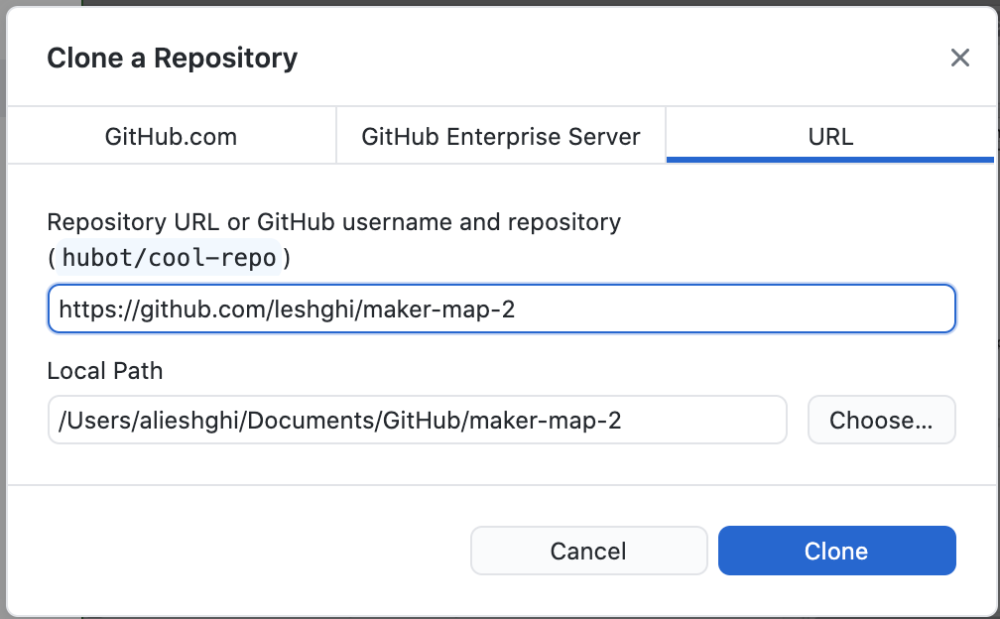
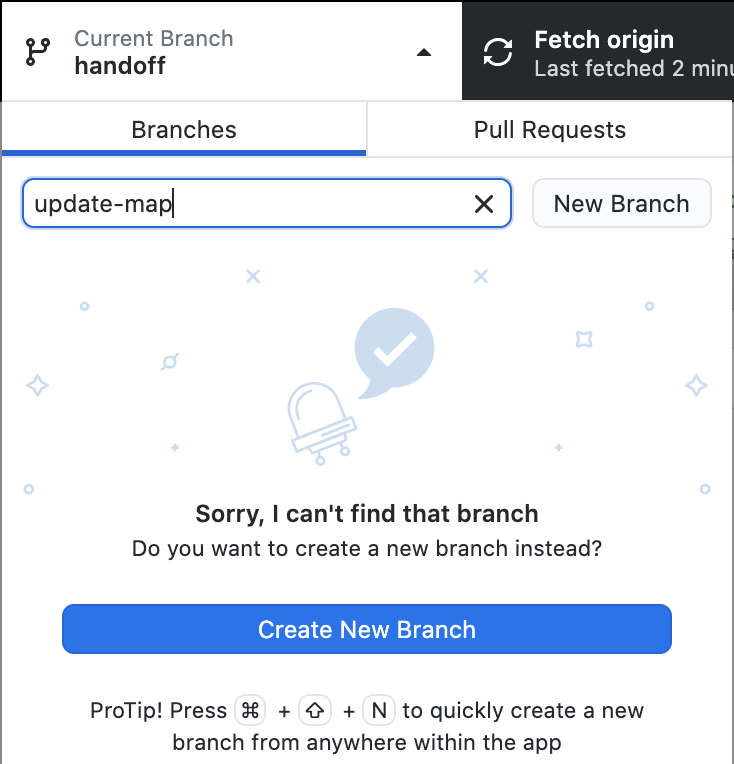
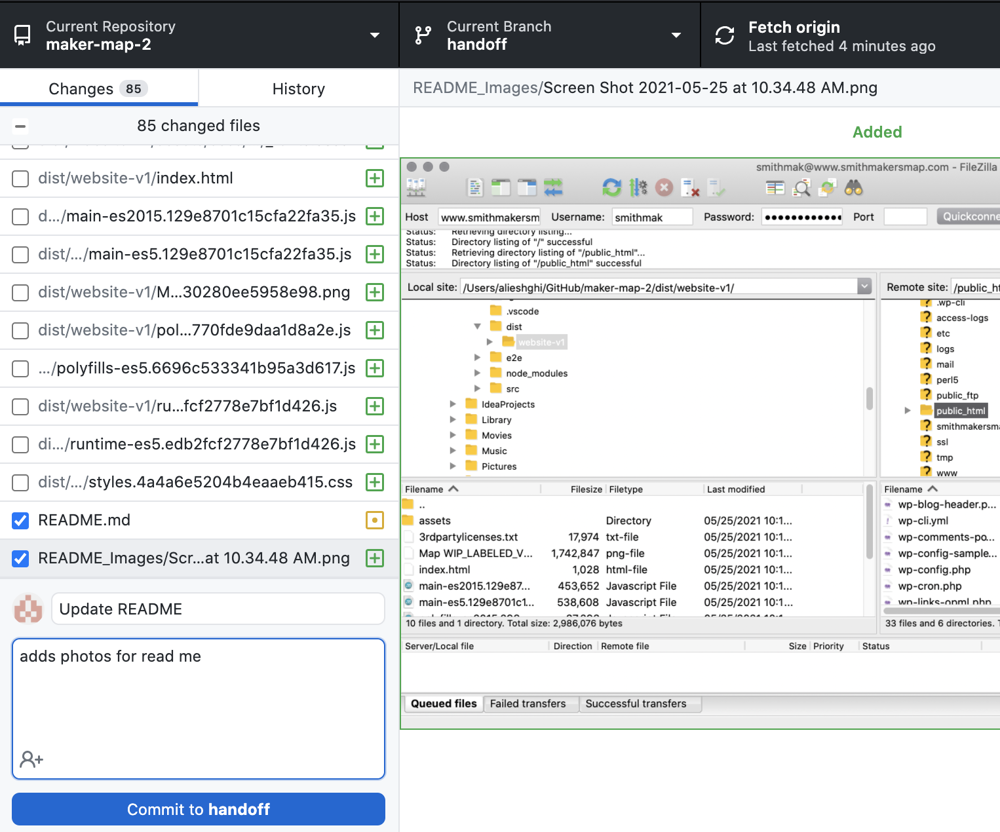
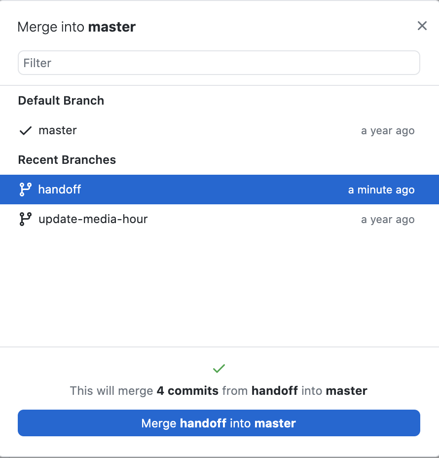

# Smith Makers Map

This project was generated with [Angular CLI](https://github.com/angular/angular-cli) version 8.3.21.

## Updates

To update the app follow these steps:

### Enviroment Setup

Get the Github repository on your computer (You can skip parts 1 and 2 if you already are set up)

1. If you do not have a github account, you will have to make one at https://www.github.com

2. Download [Github Desktop](https://desktop.github.com/). 

3. Sign in with your account, and follow the instructions [here](https://docs.github.com/en/desktop/contributing-and-collaborating-using-github-desktop/adding-and-cloning-repositories/cloning-a-repository-from-github-to-github-desktop) to get the Makers Map repostory at link: https://github.com/leshghi/maker-map-2

 

4. Make a new branch and open the code in the editor of your choice (I recommend [VSCode](https://code.visualstudio.com/))

 

5. If you do not already have it - download node following the instructions [here](https://nodejs.org/en/download/)

### Updating the App

Use Github Desktop to open the repository, and update the code you would like to change.

Make sure to check your changes by running `ng serve` in your terminal from the project root (path/to/repository/on/your/computer/maker-map-2) for a dev server. Navigate to `http://localhost:4200/`. The app will automatically reload if you change any of the source files.

### Pushing your chages to github

 Once you are happy with your changes, it is time to upload them to github so that everyone can access the most recent version of the code! Here is how to do that on GitHub Desktop 

First, commit all your changes on the branch you created and push to the origin. Only the files with the blue check mark will be committed.
  

Now, push your changes to the origin
 

Switch to the master branch 
 

Now, merge in your branch to the master branch 
 

Push your changes to the origin one last time and you should be all set! You can check by going to the online github repository and making sure you see your updates

## Uploading changes to the server

Follow the instructions [here](https://www.c-sharpcorner.com/blogs/how-to-publish-an-angular-application) to upload the website to Bluehost. You can use the host www.smithmakersmap.com and FTP user "smithmak" to connect to the bluehost server for upload. All other information  (password, etc) you should already have. See [here](https://www.bluehost.com/hosting/help/ftpaccounts) for more details working with Bluehost and FTPs.

 

Another option is to go to Advanced Settings>Files>File Manager. There you will find all files used for your website. 

 

From there, you can drag and drop the files from inside your created dist folder into the public_html folder shown in File Manager.Make sure to delete old copies of the files to make sure only the new ones are used!

 

